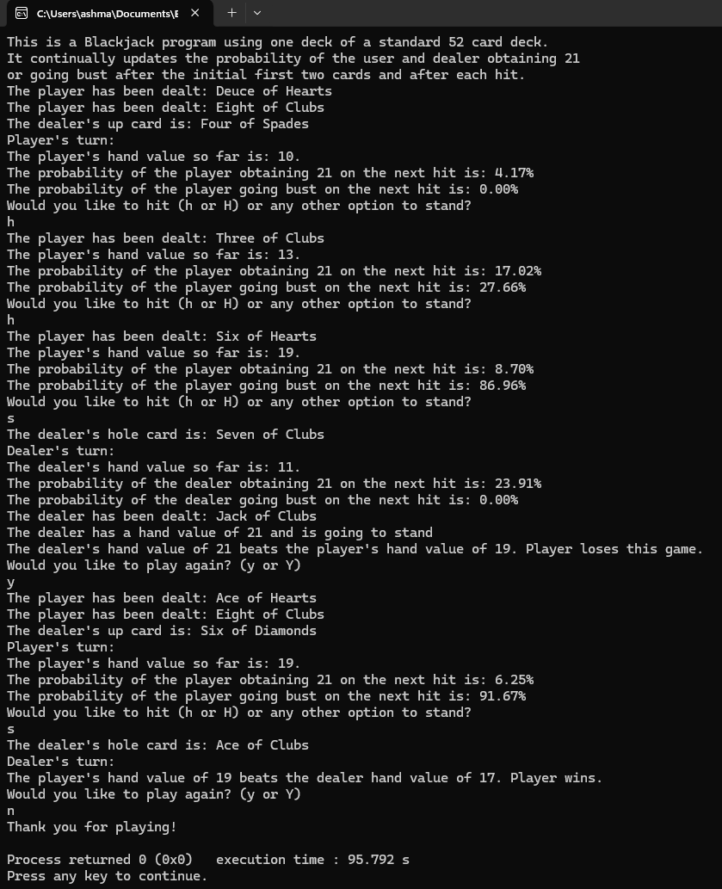

# Blackjack

## Table of contents
* [General Info](#General-info)
* [Author](#Author)
* [Programming Approaches](#Programming-approaches)
* [Techologies](#Technologies)
* [Setup](#Setup)
* [Usage](#Usage)
* [Minimum hardware requirements](#Minimum-hardware-requirements)
* [Features](#Features)
* [Screenshots](#Screenshots)
* [Project status](#Project-status)
* [Room for improvement](#Room-for-improvement)
* [Release date](#Release-date)
* [Acknowledgements](#Acknowledgements)
* [Sources](#Sources)
* [Contact](#Contact)

## General info
JasonAshCIS7DiscreteStructuresCourseProjectBlackjack.cpp is a program that I wrote in C++ for the course project in CIS-7: Discrete structures, taught at Moreno Valley College (MVX) by Prof. Kasey Nguyen, PhD. It is a text-based C++ Blackjack game that demonstrates discrete structures concepts through algorithms that accomplish the game's logic according to its rules, and it continually updates the probability of obtaining 21 or going bust before and after each hit.

## Author
- Jason Ash, Computer Science Major

## Programming approaches
I completed most of the project documentation and all of my flowchart before I began coding. This planning phase helps the development and coding process go smoothly and be less error-prone. I have previously taken CIS-5 and CIS-17A (Programming Concepts and Methodology C++ I and II, respectively) at MVC, and I applied the knowledge I gained from those courses, along with what I have learned in my Discrete Structures so far, to develop this program. I didn't create a cards class, and my program is entirely procedural with separate functions to accomplish:
- Dealing cards
- Displaying the name of a card corresponding to its unique integer
- Using modulo division to determine the suit
- Tallying the value of a hand
- Determining the value of aces depending on the hand value so far
- Calculating the probability of obtaining 21 or going bust on the next hit.

## Technologies:
I wrote the source code in Notepad, and edited syntax errors (and a few logic errors) using Code::Blocks IDE. I compiled it using Code::Blocks' default GNU GCC compiler.

## Setup
To make an executable file, compile the source code using your favorite C++ compiler or IDE. Then, run the resulting executable.

## Usage
After running the program, the program's purpose is displayed, and it deals the player and dealer two cards each, which are shown as text. Only the dealer's up card (second card) is shown until the dealer's turn. The program totals the player's hand and asks the player whether or not they want to hit by entering 'h' or 'H'. The probability of obtaining 21 or going bust (calculated as the number of possible next hands that result in that outcome divided by the total number of outcomes) is displayed, informing the player so that he/she can strategize accordingly. Note: on hands with a value of 11 or less, the probability of going bust will be zero, and the likelihood of obtaining 21 on a hand of 10 or less is zero. During the dealer's turn, the up card is revealed, and the program likewise displays the probability of the dealer obtaining 21 or going bust on the next hit. The dealer's turn is automated according to casino rules, which are that the dealer must hit on 16 or less and stand on 17 or more. At the end of the game, the player is prompted to enter 'y' or 'Y' to play again.

Scoring is also done according to casino rules:
- If the player obtains a Blackjack, the player automatically wins.
- If both the player and dealer are dealt Blackjacks, then the player also wins.
- If the dealer has a Blackjack, but the player does not, the player automatically loses.
- If the player busts, then he/she loses even if the dealer also busts.
- If the player and dealer have the same hand, that is called a push, and the game outcome is considered a tie.
- If none of the above scenarios apply, then the player wins if their hand is closer to 21 without going over, and the dealer wins if the dealer's hand is closer to 21 without going over.

## Minimum hardware requirements
Although I developed this on a fairly recent Windows 11 PC, this program should run comfortably on any working computer with sufficient processing power, RAM, a monitor manufactured within the past 15-20 years, and an Internet connection to download the .cpp source file. 

## Features
- One player in addition to the dealer.
- Implements a standard 52-card deck without Jokers.
- The player will be allowed to hit until 21 is reached or they go bust.
- Aces count as 11 on any hand with a value of 10 or below. In hands with a value of more than 10, aces count as one.
- The AI strategy of the dealer follows casino rules in that the dealer must hit on a hand with a value of 16 or less and stand on 17 or more.
- Scoring is done according to the casino rules explained above.
- The dealer's hole card is not revealed until after the player's turn is complete.

## Screenshots

## Project status
Completed according to the requirements of the project and released here on GitHub.

## Room for improvement
- Implementing two or more players.
- Implementing bet amounts of pretend money and keeping track of the player's current amount of money, bets, and wins and losses.
- The player would earn 1.5x their bet on a Blackjack, 2.5x their bet if both the player and dealer get a Blackjack, the bet is refunded upon a push, and the player loses their bet upon any losing scenario (see rules above).
- Allowing the player to double down, in which the player can double their bet and is allowed to be dealt only one additional card beyond the two initial cards dealt.
- Allowing the player to split pairs and play multiple hands.
- Implementing multiple decks (this might be challenging to write).
- Displaying the player's probability of winning against the dealer based on the dealer's up card.

## Release date
24 November, 2025

## Acknowledgements
Prof. Kasey Nguyen is the project advisor.

## Sources
James, Jason. Exploring C++: The Adventure Begins. Craieprogramming.Org, 2025, OER Series Exploring C++ The Adventure Begins, https://craieprogramming.org/OER/, Accessed 18 Feb. 2025.
(I'm citing this textbook because the only thing from it that I used was the algorithm for generating random integers from the lowest to highest value (inclusive), because I need that as part of my algorithm to shuffle the deck at the beginning of each game.
I created my flowcharts from scratch using miro.com. I edited them slightly with circles and letters in Microsoft Paint afterwards to clarify which branch goes to the next one, since my screenshots of the flowchart were captured in a series of approximately page-sized single .png files.
